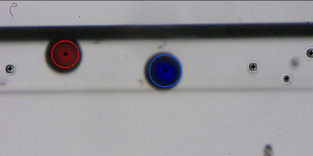
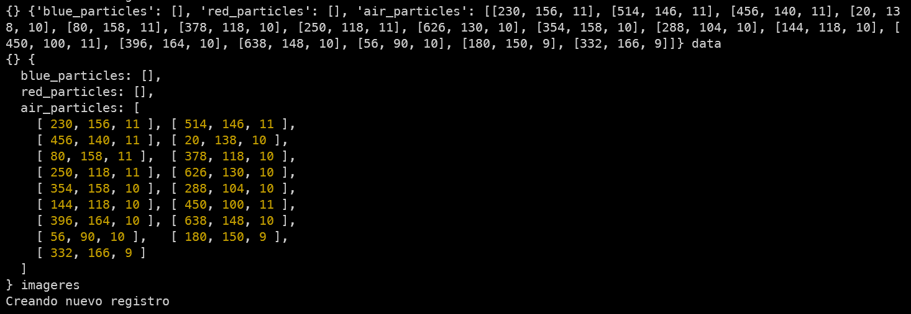
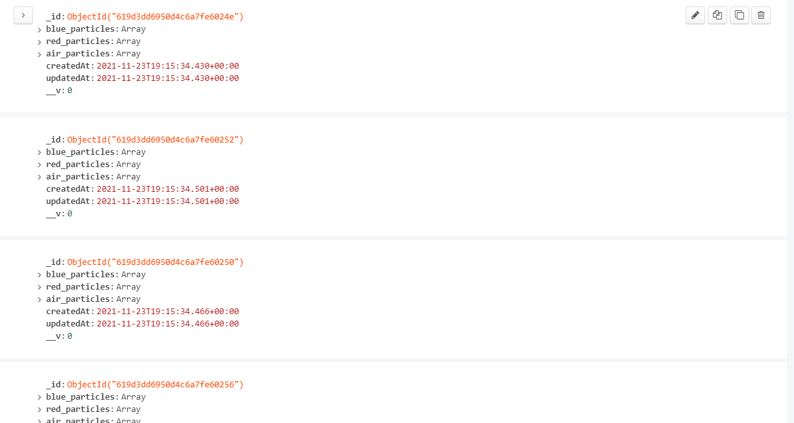
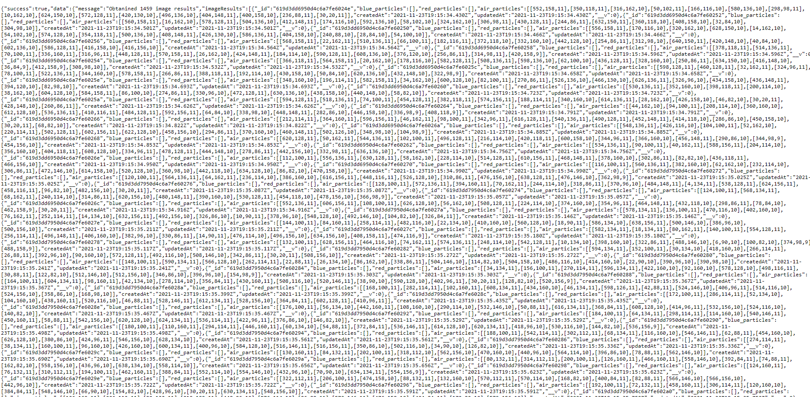
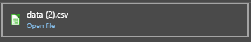
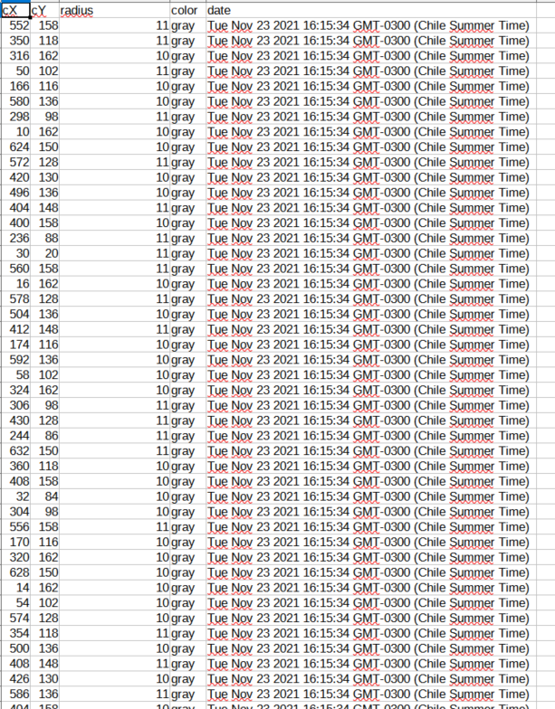

# Embedded Python Sample Interface

By using tools such as; Python, OpenCV, Numpy, JavaScript, the objective is to create an embedded program with Python that manages to process images, figures or elements that it receives from the Spica emulator and sends them via http protocol to another server. 

<br>

Below you can see images that demonstrate the operation of the image recognition module in which both the centroids and the contours of said images are found. 

<br>


<br>

It should be noted that within this module the following data must be obtained:
- Particle Detection    
    - Oxygen
    - Hydrogen 
    - Air particles
- Centroid
- Radius 

<br>

## Installation requeriments for project
In order to test the effectiveness of the python application, as a first step, clone the repository 

```
    $ git clone 
    https://github.com/DarAkus1420taller-de-integracion-3.git		
```

<br>

Below are the commands that must be executed by console before being able to execute and test the functionality of our project

In the api folder:

```console
    $ npm install 
```

In the python_app folder:

```console
    $ pip install -r requeriments.txt
```

<br>

## Description of the background of the code implemented in the project

Throughout the programming carried out in the different modules, the implementation of different algorithms can be noticed, among which it is worth highlighting

- Hough transform algorithm:
    - The Hough transform is a technique for detecting figures in digital images. This technique is mostly used in the field of Computer Vision. With the Hough transform it is possible to find all kinds of figures that can be expressed mathematically, such as lines, circles or ellipse
    
    <br>

    In the following image we can clearly appreciate the efficiency of the application of this algorithm through the same filter that I dealt with previously. 
    
    

<br>

- Centroid detect using color range
    -  The basic idea is to have a range of preset colors, to be able to find the red and blue particles, this to be able to obtain a little more performance
    - This allows us to obtain with 100% precision the presence of red or blue particles, being able to find their radius and centroid.
    
    <br>

    


<br>


## How to run the project

The program receives the images through the stapi library, which is a means of communication between the emulator or image software and our project

In the same way, the answers of the analysis are sent using this library

Additionally, our program is enabled to send the data to an api, which is also included in this repository. The standard way to run the api is by entering its respective folder and executing the following command.


```console
    $ npm run dev
```

This will start the api in a development mode, which allows you to see the logs when the data is saved
An important detail to mention is that due to limitations of using python in an embedded way, it is necessary to convert the data to a string before sending it to the server.

Due to this on the server the data must be converted into an object, to later save it in the database



Once received they are saved in the database with the following structure



The fastest way to get all the records is using an api route (localhost:3000/api/v1/imageResults)

When entering this in the browser, the data of all the images that have been processed will be obtained



As you can see, the information is very messy, but it is a very good way to send this data to a frontend application.


Another way we have to download the information is with a csv.



The way to obtain this is by entering the path localhost:3000/api/v1/imageResults/generate/csv.Which generates a csv with the following structure.




Soon we have planned to add a system so that emails with this data can be received, a limit of images based on the last ones received (for greater optimization) and the generation of a pdf with a little more general information

## Licence of project

MIT License

Copyright (c) 2021 DarAkus1420

Permission is hereby granted, free of charge, to any person obtaining a copy
of this software and associated documentation files (the "Software"), to deal
in the Software without restriction, including without limitation the rights
to use, copy, modify, merge, publish, distribute, sublicense, and/or sell
copies of the Software, and to permit persons to whom the Software is
furnished to do so, subject to the following conditions:

The above copyright notice and this permission notice shall be included in all
copies or substantial portions of the Software.

THE SOFTWARE IS PROVIDED "AS IS", WITHOUT WARRANTY OF ANY KIND, EXPRESS OR
IMPLIED, INCLUDING BUT NOT LIMITED TO THE WARRANTIES OF MERCHANTABILITY,
FITNESS FOR A PARTICULAR PURPOSE AND NONINFRINGEMENT. IN NO EVENT SHALL THE
AUTHORS OR COPYRIGHT HOLDERS BE LIABLE FOR ANY CLAIM, DAMAGES OR OTHER
LIABILITY, WHETHER IN AN ACTION OF CONTRACT, TORT OR OTHERWISE, ARISING FROM,
OUT OF OR IN CONNECTION WITH THE SOFTWARE OR THE USE OR OTHER DEALINGS IN THE
SOFTWARE.


